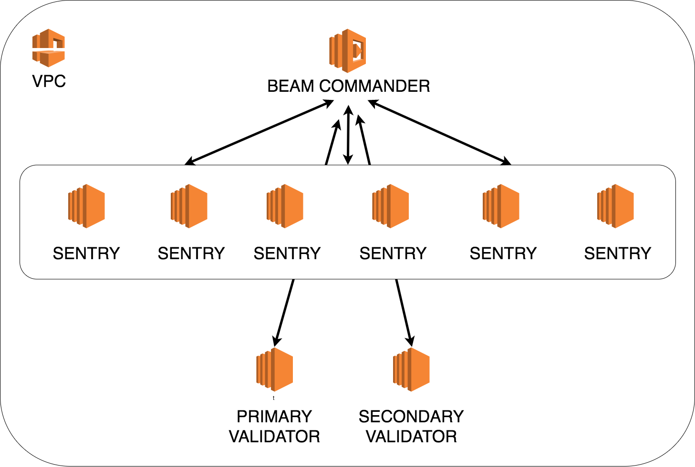

Beam is aimed to be a full-service management tool for running a [Cosmos](https://cosmos.network) Validator. Beam enables you to run a highly available and secure Validator behind a dynamic set of Sentrys. The Beam project comes in two pieces, Beam Pilot and Beam Commander. Beam Pilot is a tool to be installed on your servers, while Beam Commander is a Lambda Function that communicates with all the Pilots. Beam is designed to handle all the needs of running a dynamic Validator architecure without manual processes.

_While Pilot can be installed on any server, Commander is written to only be ran in AWS Lambda. Therefore, there is a requirement that this tool only be ran in [AWS](https://aws.amazon.com)._

## Beam Pilot

Pilot is a tool that installs onto your Sentry and Validator servers. It can be used to control the server, as well as talk to the Commander. The Pilot will gather information from gaiad, the server, and the Cosmos Network. Then it will act on that information based on what is appropriate. 

Examples of actions are:

- Auto-Bonding of Stake
- Alert on a new Proposal
- Auto-Voting
- Change gaiad configuration file
- Ask the Commander for assistance if getting overwhelmed

_Pilot can be ran with or without a Commander, however a lot of features are lost without a Commander._

See the [Pilot directory](./pilot) for more information.

## Beam Commander

Commander is a Lambda function that controls and talks to all of the Pilots. The Commander runs a check at a given interval to check on all connected Pilots. If a Pilot has something that needs to be done, the Commander takes will execute that action. If a Pilot fails health checks, the Commander will replace it. The Commander will also generate dynamic gaiad configuration files for the Pilots to use so all servers are up to date.

Examples of actions are:

- Alert to various messaging endpoints
- Failover Validator Nodes
- Change the public IP address for a server under distress
- Generate dynamic gaiad configuration files
- Check health of all Validator and Sentry servers

See the [Commander directory](./commander) for more information.

## Getting Started

To learn how to get started with Beam, see the [GETTING-STARTED.md](GETTING-STARTED.md) file.

## Beam Infrastructure

The [Infrastructure directory](./infrastructure) contains a collection of [Terraform](https://terraform.io) templates to be used as examples on how to create a compatible Beam architecture.

### Architecture Diagram

#### Maintainer

[Graham Krizek](https://github.com/gkrizek)

